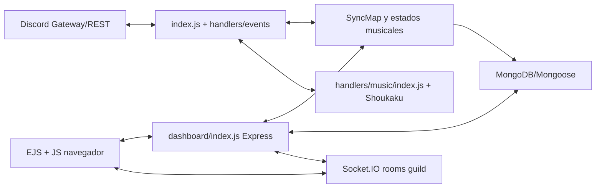
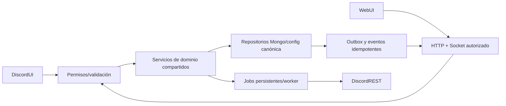

# Auditoría de plataforma OBEY

Fecha: 2026-10-04. Base: `feat/motor-soundy`; trabajo aislado en `/home/obey-platform-work`. Auditoría estática y carga local de schemas, sin iniciar `index.js`, conectar Discord, registrar comandos, usar producción ni leer `.env`. Los siete originales (8.051 líneas) y el maestro se leyeron completos. Las cifras y restricciones históricas son antecedentes; el maestro decide contradicciones. Los helpers del paquete son referencias, no integración probada.

## Entradas y arquitectura real

`index.js` construye un Client discord.js, conecta Mongoose y Shoukaku, registra handlers y hace login. `handlers/events.js` carga eventos; `handlers/command.js` y `handlers/slashCommands.js` cargan comandos; `events/guild/interactionCreate.js` resuelve slash/autocomplete y delega mediante `handlers/command-execution.js`. Bot, HTTP y Socket.IO comparten proceso: `dbReady` inicia `dashboard/index.js`. No hay separación de worker/API ni cola durable general.

`handlers/loaddb.js` precarga colecciones y emite dbReady; configura aliases `settings`, `setups`, `musicsettings`, `reactionrole` y `social_log` sobre el mismo SyncMap Guild. `handlers/sync-map.js` cambia memoria inmediatamente y serializa writes de fondo; `flush()` propaga errores acumulados. La serialización es local y no ofrece atomicidad entre procesos. Web settings también escribe directamente GuildSchema y actualiza múltiples caminos legacy: necesita servicio canónico y precedencia explícita antes de separar procesos.

Música ya posee cola/estado compartido, acciones serializadas, guards, persistencia de sesión, búsqueda/catalog y recuperación. Flujo activo `handlers/music/index.js` importa `embeds.js` y `liveupdate.js`; modificar solamente `ui.js` no transforma el reproductor usado.

## Dependencias efectivas

`package-lock.json`: discord.js **14.27.0**, Mongoose **8.24.4**, Express **4.22.3**, Socket.IO **4.8.3**, Shoukaku **4.3.0**, @napi-rs/canvas **0.1.100**, Sentry **8.55.2**. Entorno auditado Node **22.23.2**; Docker `node:22-slim`; package exige Node >=20. Versiones de lock no prueban servicios desplegados. El `node_modules` compartido mediante symlink tiene discord.js **14.26.4**, Mongoose **8.24.0**, Express **4.22.2**; Socket.IO/Shoukaku/canvas/Sentry coinciden con el lock. La carga local auditada usa las versiones instaladas: hace falta `npm ci` en entorno aislado y repetir checks con el lock antes del cierre del PR. Redis, BullMQ y adaptador Socket.IO Redis no están declarados. Mantener Mongo, Shoukaku, CommonJS y EJS; no introducir TypeScript/Next/monorepo por la propuesta histórica.

## Inventario de comandos, intents y eventos

Carga local de `handlers/slashCommands.js` con `{ slashCommands: new Collection() }`, sin Client/login ni REST: **19 raíces**, **165 subcomandos**, **1 raíz standalone (`chat`)**, **166 acciones leaf**. Raíces: admin, anime, birthday, config, economy, favoritos, fun, giveaway, info, invites, moderation, music, nsfw, playlist, rank, soundboard, ticket, welcome, chat. No hubo logs de error en esa carga. No se publicaron schemas. Inventario prefijo mediante carga de módulos sin inicializar `handlers/command.js`: **645 archivos / 645 nombres raíz únicos**, **786 aliases resueltos**, **29 conflictos de aliases**, **0 fallos de carga**. No se cuentan aliases como nuevos comandos; el resolver conserva su prioridad explícita. Inventario por archivo/nombre/aliases/permisos y versiones instalado/lock persistido en `requirements.json.auditInventory`. Este inventario tampoco demuestra ejecución ni permisos efectivos en Discord. `scripts/audit-commands.js` escribe otros documentos y omite archivos raíz; no se ejecutó porque su salida no representa este conteo y está fuera del área asignada. `docs/audit/command-loader.json` indica 810 cargas históricas, sin demostrar schemas ni ejecución; no se usa como cifra de slash raíz.

Intents declarados en index: Guilds, GuildMembers, GuildModeration, GuildEmojisAndStickers, GuildIntegrations, GuildWebhooks, GuildInvites, GuildVoiceStates, GuildPresences, GuildMessages, GuildMessageReactions, DirectMessages, DirectMessageReactions, MessageContent. Members/Presences/MessageContent necesitan verificación de disponibilidad antes de módulos dependientes; no se comprobó aprobación del Developer Portal. Partials: Message, Channel, Reaction, GuildMember, User.

`handlers/feature-registration.js` gatea eventos de mensaje, reacción, miembro, guild, voz, interacción y creación/eliminación de canal a dbReady; normaliza ready a dbReady. No equivale a manifests por módulo ni habilitación por guild. Listener musical `playerStateUpdate` transporta guildId sin envelope versionado; faltan contratos/proyecciones/outbox comunes para recursos, tickets, casos, seguridad y Architect.

Permisos slash actuales: `memberpermissions`, permisos musicales DJ/requester, voice/same-channel y botchannel. No hay RBAC granular compartido general. Hay handlers separados y collectors de componentes; la entrada slash no es un router completo de botones/selects/modals.

## Páginas y rutas

Landing conservado: `dashboard/public/index.html` servido por `/`. Zona EJS: `/panel`, `/dashboard` (selector), `/dashboard/:guildId` GET/POST (settings), `/stats/:guildId`, `/music/:guildId`, `/library/:guildId`; `/player/:guildId` redirige a música. Vistas reales: `dashboard/views/pages/{home,dashboard,guild,stats,music,player,library}.ejs`.

HTTP dashboard: `/health`, `/login`, `/auth/callback`, `/logout` POST, `/api/refresh-guilds` POST, `/api/sse`, `/api/stats`, `/api/nowplaying`, `/api/invites/:guildId`, `/api/player/:guildId`, `/api/player/:guildId/action`, `/api/player/:guildId/top-tracks`, `/api/player/:guildId/voice-channels`, `/api/player/:guildId/preview`, `/api/player/:guildId/search`, `/api/player/:guildId/add`.

`handlers/music/apiRoutes.js` añade `/api/music/health`, `/api/music/status/:guildId`, `/api/music/search`, `/api/top/{tracks,users,guilds}`, `/api/music/{liked,recent,like}`, `/api/playlist/list`, `/api/playlist/view/:playlistId`, `/api/playlist/{create,add,remove,delete}`. Ownership se deriva de la sesión en playlists y favoritos. No hay API/UI de Architect, templates, tickets operativos ni automations.

## OAuth, seguridad y realtime

KEEP/EXTEND: OAuth state aleatorio consumido en callback; tokens de acceso/refresh en sesión Mongo; cookie httpOnly/sameSite lax/secure cuando BASE_URL HTTPS; refresh OAuth en middleware HTTP. `dashboard/security.js` comprueba token CSRF y origen en mutaciones autenticadas. `dashboard/permissions.js` actualiza guilds OAuth antes de ciertas mutaciones. `canManageGuild` comprueba owner/Admin/ManageGuild, no acepta mera presencia en lista.

Pendientes críticos:

- `/api/nowplaying` es público y devuelve guild IDs/nombres/pistas de todos los guilds con reproducción. `/api/top/tracks` y `/api/top/users` admiten guildId público. Revisar política de visibilidad y proteger datos por guild antes de ampliar APIs.
- Selector actual filtra solo guilds administrables; falta instalado/sin permisos.
- Socket handshake solo comprueba user en sesión; join comprueba permisos OAuth cacheados. No refresca/revoca rooms al cambiar permisos ni distingue módulos; rooms son guildId crudo. Los endpoints secundarios usan apiAuth diferente de requireAuth: revisar expiración/refresh consistente.
- No hay secuencias/revisiones, replay/resync sin ventana ni envelope común. El socket entrega `player:state` y `player:tick`, este último cada 2 segundos; SSE público agrega estadísticas cada 5 segundos.
- `/api/music/health` devuelve ok constante; `/health` combina DB y nodo musical sin medir Gateway/workers/Redis. No debe presentarse como salud global completa.
- Callback no llama session.regenerate; evaluar rotación tras login y límites/timeouts de proveedores. No se inspeccionaron sesiones ni tokens reales.

## Persistencia, jobs y operaciones

Schemas existentes (34): Guild/User/Ticket/Moderation/Economy/Ranking/Profile, música Session/History/Playlist/LikedSongs/Stats, Giveaway, Backup, Birthday, JTCSchema y stores auxiliares bajo `database/schemas/`. Ticket actual contiene status open/closed/claimed y transcript básico; faltan objeto mensaje con ID/dedupe, notas internas, transferencia/retención/métricas. Moderation contiene caseId/actor/motivo/duración/active, faltan contrato uniforme fuente/evidencia/revocación y servicio web compartido.

EconomySchema contiene guildId/userId pero no índice compuesto único ni ledger/idempotency keys. SyncMap usa por defecto guildId; no asumir que eso resuelve wallets por usuario, atomicidad o doble claim. Reconciliar claves existentes antes de migrar.

`handlers/autobackup.js` y `handlers/timedmessages.js` usan cron; cumpleaños combina timeout e interval diario. `handlers/giveaway.js` usa discord-giveaways con modelo persistente; conservarlo y verificar reinicios. `commands/School-Commands/remind.js` requiere programación durable. No existe BullMQ/worker/outbox/lock distribuido ni operaciones Architect. Hay discord-backup y comandos create/load/list: EXTEND con snapshots versionados, alcance/completitud y remapeo; no prometer IDs/mensajes restaurables.

## Clasificación de subsistemas

| Área | Decisión | Evidencia / motivo |
|---|---|---|
| Landing | KEEP | dashboard/public/index.html; aprobado explícitamente |
| Stack/persistencia/motor | KEEP | package.json, Dockerfile, index.js; compatibilidad primero |
| OAuth/HTTP/sesión | EXTEND | dashboard/index.js, dashboard/security.js; base válida, falta granularidad |
| Permisos/socket | EXTEND | dashboard/permissions.js, handlers/music/permissions.js; refresh/revocación pendientes |
| Configuración/cachés | REFACTOR | handlers/loaddb.js, handlers/sync-map.js; servicio canónico y await/atomicidad críticas |
| Registry/manifest/router | REFACTOR | handlers/command-registry.js, handlers/feature-registration.js, events/guild/interactionCreate.js |
| Events/outbox/Redis | MISSING | Solo EventEmitter playerStateUpdate en handlers/music/index.js |
| Jobs generales | MISSING | Cron/timers no son ejecutor durable estructural |
| Discord UI | EXTEND | handlers/helpui.js, handlers/music/embeds.js; conservar IDs activos |
| Asset Registry/pipeline | MISSING | Pack fuente no integrado; handlers/canvasUtils.js es base renderer |
| Welcome/farewell | REFACTOR | handlers/welcome.js, handlers/leave.js; preview/evento/message/msg |
| Música | EXTEND | handlers/music/index.js, sessions.js, saved-queues.js; mantener backend/guards |
| Letras | EXTEND | slashCommands/Music/lyrics.js calcula pages pero muestra pages[0] y pide repetir; handlers/music/index.js:740 aún trunca fallback mp_lyrics a 1.800 caracteres |
| Architect/diff/themes | MISSING | No servicio blueprint/diff/apply; backups no lo sustituyen |
| Templates | MISSING | Sin biblioteca/paquete portable/instalación segura |
| Backups | EXTEND | commands/Administration/createbackup.js, loadbackup.js, database/schemas/BackupSchema.js |
| Moderation/AutoMod/Security | REFACTOR | slashCommands/Moderation, handlers/anti_nuke.js, antispam.js; separar servicios/incidentes |
| Verification/logging/roles | EXTEND | handlers/validcode.js, logger.js, reactionrole.js; permisos/retención/jobs |
| Tickets | EXTEND | handlers/ticket.js, ticketevent.js, TicketSchema.js; flujo web pendiente |
| Comunidad | EXTEND | suggest.js, ranking.js, giveaway.js, jointocreate.js; economía atómica y starboard |
| Feeds/embed builder | EXTEND | social_log/youtube.js, handlers/autoembed.js; estado credenciales/cuotas |
| Automation Engine | MISSING | timedmessages no equivale a Trigger/Condition/Action persistido |
| Web autenticada | EXTEND | EJS existente, internal-theme.css; dominios operativos por slice |
| Analytics/observabilidad | EXTEND | StatsSchema/TrackStatsSchema, logger.js, dashboard/index.js; eventos reales |
| CI/migraciones | MISSING | No .github/workflows; package scripts start/dev/test |
| REPLACE | Ninguno de entrada | Reemplazar solo implementación con incompatibilidad demostrada; no sustituir stack por moda |

## Docker, pruebas y deuda directa

Docker incluye todo el árbol mediante COPY; mantener fuentes/assets del runtime y limitar contexto mediante .dockerignore revisado por cada slice. Compose: images, bot y lavalink opcional (managed-lavalink), red host, mem limits/healthchecks; no Mongo/Redis/worker declarados. No construir ni iniciar Compose contra producción en esta auditoría. index shutdown hace flush, deja voz y destruye Client/Mongoose, pero accede a `client.shoukaku.players` sin guard y no cierra servidor Socket.IO ni tick explícitamente.

22 archivos de pruebas existentes bajo test cubren música, seguridad/CSRF, fresh permissions, SyncMap, saved queues, lifecycle/recovery, catálogo, UI y loader; nombres de tests no prueban aceptación. No se ejecutaron en esta auditoría de solo lectura. Evidencia comprobada: lectura de código, versiones lock y carga local de schemas (19/165/1). Tests en Discord y browser siguen pendientes con entorno autorizado; nunca inferirlas de mocks o arte del ZIP.

## Arquitectura objetivo y siguiente checkpoint

Decisiones: evolución CommonJS/EJS, monolito modular y migraciones pequeñas; Discord autoridad de recursos, Mongo de estado OBEY, Redis temporal/coordinar y cola durable para operaciones. Cada dominio se entrega con HTTP/eventos/UI/permisos/error/pruebas, nunca solo navegación. Matriz `requirements.json`: 148 bloques completos del maestro, IDs OBEY-sección-bloque; todos pendientes de aceptación integral. El primer slice implementa registry/pipeline y fallbacks en 12 controles musicales activos. Después permisos/contratos y config/realtime. Plan ejecutable y aceptación en `tasks/plan.md` y `tasks/todo.md`; ninguna fase equivale a plataforma completa.

## Referencias primarias verificadas

Consultadas el 2026-10-04 como base técnica acotada; no se investigaron ni certificaron capacidades actuales de los bots de benchmark históricos.

- [Discord Components Reference](https://docs.discord.com/developers/components/reference): reglas por formato de mensaje, campos, nesting y custom IDs; ActionRow top-level no es universalmente inválido.
- [Discord Emoji Resource](https://docs.discord.com/developers/resources/emoji): operaciones application emoji para el pipeline.
- [Socket.IO Redis adapter](https://socket.io/docs/v4/redis-adapter/): matriz de capacidades para elegir transporte/coordinación; no usar supuestos de recovery histórico.
- [BullMQ Jobs](https://docs.bullmq.io/guide/jobs/): guía oficial para diseño de tareas durables, todavía no instalado en OBEY.

## Estado del primer slice (checkpoint del agente principal)

Registry/pipeline/control integration están en desarrollo por el agente principal, con comportamiento offline previsto. Carga real de emojis y previews/render QA quedan pendientes. T02–T04 y fase 1 no se marcan completas desde esta auditoría; evidencia de tests focalizados y commit debe añadirse al cierre de la entrega concreta. Letras se corrigen en paralelo por el agente principal; el diagnóstico anterior describe el baseline, no su estado posterior.
