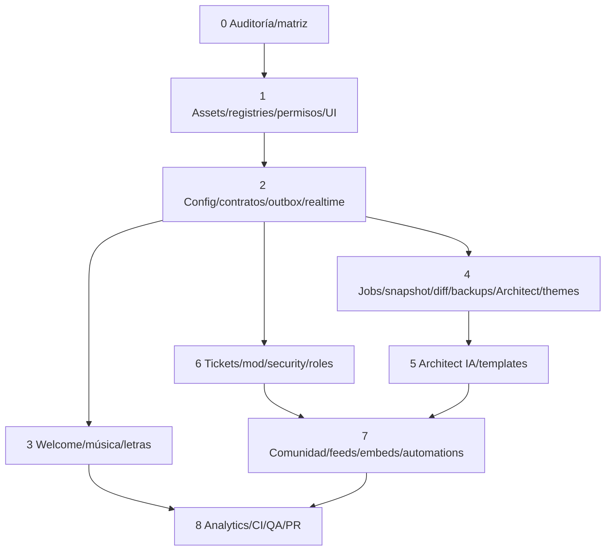

# Plan de implementación de la plataforma OBEY

El maestro integral gobierna los siete antecedentes y recursos aprobados. El trabajo autorizado comprende desarrollo incremental, documentación, pruebas y PR hacia `feat/motor-soundy`; no comprende merge/deploy, cambios sobre servidores reales de usuarios, restauraciones reales ni gasto externo. Landing conservado; identidad web existente y personaje aprobado dentro de Discord.

## Decisiones y dependencias

CommonJS/EJS/Mongo/Shoukaku se conservan. Manifest/servicios/repositorios/contratos se introducen en la parte modificada; sin reorganización masiva ni adapters vacíos. Discord mantiene autoridad de recursos; Mongo mantiene configuración/datos OBEY; Redis coordina estado temporal, locks y cola durable tras ADR. Los handlers Discord y HTTP llaman al mismo servicio y proyección de estado. Cada slice conecta permisos, persistencia, errores, HTTP/eventos/web y tests de ese dominio.

## Estrategia de entrega

Primera entrega: registry/pipeline offline reproducible y fallbacks en controles musicales activos (T02–T04), con T01 ya producido y aceptación aún revisable. No llamar completa a la fase 1 ni a la plataforma. Cada tarea toca como objetivo 3–5 archivos: los paths nuevos son previstos, los existentes son evidencia; si la implementación exige más, subdividir manteniendo IDs y alcance. Permisos/contratos/shared-state se ejecutan secuencialmente. Las slices incluyen UI web del dominio; no postergarla toda hasta fase 8.

Requisitos trazados en `docs/platform/requirements.json`: 148 bloques íntegros OBEY-SS-BB. Estado pendiente hasta aceptación completa; la carga local de schemas no prueba ejecución real en Discord. Ejecución siguiente: T02/T03/T04 por el agente principal. Tras cada checkpoint registrar comandos exactos/resultados, diff, requisitos cubiertos y pendiente ejecutable.

## Riesgos y mitigaciones

| Riesgo | Mitigación |
|---|---|
| Config SyncMap y writes directos web divergen | Servicio canónico/precedencia/await en T12; contract tests dos interfaces |
| Socket mantiene permisos antiguos | Autorizar/revalidar/revocar T06/T15 y probar denial/reconexión |
| Acciones repetidas por retry/worker | Idempotency key, logical ID mapping y verificar estado real antes de crear |
| Restauración destructiva/conflicto | Revisión ligada snapshot, backup completo, rollback limitado propuesto |
| Mongo sin transacciones | Verificar deployment aislado; diseñar recuperación/outbox compatible antes de prometer atomicidad |
| Credenciales o intents ausentes | Estado unconfigured/unavailable y completar vías offline/visuales independientes |
| Helpers fuente incorrectos | Adaptar y validar builders/rutas/dimensiones/versiones reales; fuentes originales intactas |
| Alcance pierde módulos durante sesiones | Matriz íntegra y todos checkpoints/task IDs estables; nada excluido por ser nuevo |

## Pendientes de entorno

Pruebas Discord Gateway/REST/OAuth real, browser, DB/Redis/worker y Docker se ejecutan solo contra fixtures/entorno aislado o servidor canary expresamente autorizado. No usar la configuración producción por defecto. Verificar límites/formatos actuales en documentación primaria cuando se implementen. Credenciales IA/emojis/integraciones no necesarias para completar dry runs, fallback, modo visual ni tests con dobles.

## Lista ordenada de tareas

- Fase 0 — [T01: Auditoría y matriz íntegra](todo.md#t01)
- Fase 1 — [T02: Asset Registry y validación offline](todo.md#t02)
- Fase 1 — [T03: Sincronización idempotente de emojis](todo.md#t03)
- Fase 1 — [T04: Fallbacks en doce controles activos](todo.md#t04)
- Fase 1 — [T05: Manifest y registro incremental](todo.md#t05)
- Fase 1 — [T06: Permisos compartidos por acción](todo.md#t06)
- Fase 1 — [T07: OAuth/API y exposición de datos](todo.md#t07)
- Fase 1 — [T08: Router y estado de interacción](todo.md#t08)
- Fase 1 — [T09: Discord UI Kit y preview](todo.md#t09)
- Fase 1 — [T10: Tokens/primitivas web y accesibilidad](todo.md#t10)
- Fase 1 — [T11: Help y setup desde registros](todo.md#t11)
- Fase 2 — [T12: Configuración canónica y precedencia](todo.md#t12)
- Fase 2 — [T13: Envelope/contratos y auditoría](todo.md#t13)
- Fase 2 — [T14: Outbox y consumidores idempotentes](todo.md#t14)
- Fase 2 — [T15: Socket autorizado y reconexión](todo.md#t15)
- Fase 2 — [T16: Selector, navegación y explorer](todo.md#t16)
- Fase 2 — [T17: Command Center y settings globales](todo.md#t17)
- Fase 3 — [T18: Welcome/farewell compartidos](todo.md#t18)
- Fase 3 — [T19: Letras completas y estado compartido](todo.md#t19)
- Fase 3 — [T20: Música metadata y límites de proveedores](todo.md#t20)
- Fase 3 — [T21: Historia, colecciones y estadísticas musicales](todo.md#t21)
- Fase 3 — [T22: Gestión avanzada de cola](todo.md#t22)
- Fase 4 — [T23: Cola durable y lifecycle worker](todo.md#t23)
- Fase 4 — [T24: Reanudación y exclusión estructural](todo.md#t24)
- Fase 4 — [T25: Snapshot y blueprint versionados](todo.md#t25)
- Fase 4 — [T26: Diff y preflight](todo.md#t26)
- Fase 4 — [T27: Backups e importación segura](todo.md#t27)
- Fase 4 — [T28: Apply Architect con confirmación de revisión](todo.md#t28)
- Fase 4 — [T29: Rollback limitado y restore con remapeo](todo.md#t29)
- Fase 4 — [T30: Editor Architect visual conectado](todo.md#t30)
- Fase 4 — [T31: Theme Engine y Decoration Studio](todo.md#t31)
- Fase 4 — [T32: Editores roles/canales y permisos efectivos](todo.md#t32)
- Fase 5 — [T33: Architect IA estructurado](todo.md#t33)
- Fase 5 — [T34: Templates oficiales/privadas e instalación](todo.md#t34)
- Fase 6 — [T35: Servicio moderación y casos](todo.md#t35)
- Fase 6 — [T36: AutoMod nativo/bot y presets](todo.md#t36)
- Fase 6 — [T37: Security y Verification reales](todo.md#t37)
- Fase 6 — [T38: Logging y retención](todo.md#t38)
- Fase 6 — [T39: Roles automáticos/sticky/temporales/menus](todo.md#t39)
- Fase 6 — [T40: Tickets persistidos y operación staff](todo.md#t40)
- Fase 6 — [T41: Ticket inbox web y transcripts](todo.md#t41)
- Fase 7 — [T42: Soporte avanzado](todo.md#t42)
- Fase 7 — [T43: Templates comunidad y valoraciones](todo.md#t43)
- Fase 7 — [T44: Suggestions y starboard](todo.md#t44)
- Fase 7 — [T45: Levels y profiles](todo.md#t45)
- Fase 7 — [T46: Economía atómica e idempotente](todo.md#t46)
- Fase 7 — [T47: Giveaways durables y reroll auditado](todo.md#t47)
- Fase 7 — [T48: Voice temporal y reminders recurrentes](todo.md#t48)
- Fase 7 — [T49: Embed/message builder conectado](todo.md#t49)
- Fase 7 — [T50: Feeds con credenciales y dedupe](todo.md#t50)
- Fase 7 — [T51: Automation runtime seguro](todo.md#t51)
- Fase 7 — [T52: Automation builder y eventos integrados](todo.md#t52)
- Fase 7 — [T53: Utility/Fun UI compatible](todo.md#t53)
- Fase 8 — [T54: Analytics por eventos reales](todo.md#t54)
- Fase 8 — [T55: Salud y recuperación medidos](todo.md#t55)
- Fase 8 — [T56: CI, migraciones y Docker](todo.md#t56)
- Fase 8 — [T57: Validación transversal y preparación PR](todo.md#t57)

## Checkpoint de trabajo activo

El agente principal prepara registry/pipeline/fallbacks de controles y paginación de letras. Carga real de emojis, previews y pruebas Discord permanecen pendientes; no se marca fase 1 completa. Registrar la evidencia exacta al cerrar el slice, manteniendo requisitos pendientes si falta aceptación integral. El entorno node_modules por symlink difiere del lock (djs14.26.4 vs14.27.0): repetir checks con instalación aislada reproducible antes del PR.
